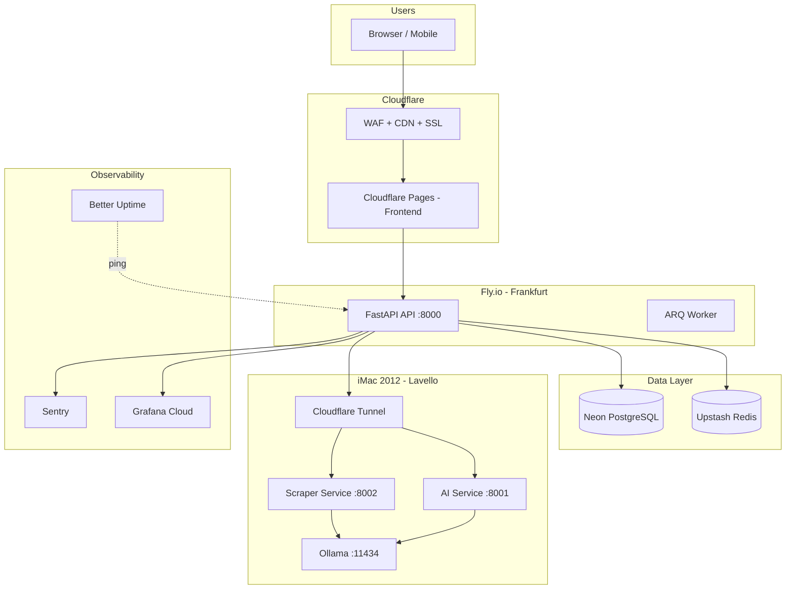

# VINTED OPTIMIZER — PIANO DEPLOYMENT ENTERPRISE v2.0
> CovE Verified | Aggiornato dal piano originale Render → Fly.io

---

## ⚠️ PERCHÉ ABBIAMO CAMBIATO DA RENDER (CovE Verified)

| Problema Render Free | Impatto | Soluzione |
|----------------------|---------|-----------|
| Cold start 30-60s | UX inaccettabile | Fly.io scale-to-zero <2s |
| 750h/mese ≈ 31 giorni | Down a fine mese | Fly.io free credit illimitato |
| No custom domains free | SEO difficile | Fly.io + Cloudflare |
| Sleep dopo 15min | API irraggiungibile | Fly.io machines management |
| Redis 25MB | Cache inutilizzabile | Upstash 10MB free (più stabile) |

---

## 🏗️ ARCHITETTURA DEPLOYMENT ENTERPRISE



---

## 🔑 CLOUDFLARE TUNNEL (per iMac locale)

Il componente critico mancante nel piano originale: come esporre l'iMac locale al backend cloud in modo sicuro.

```bash
# Installa cloudflared su iMac
brew install cloudflared

# Login Cloudflare
cloudflared tunnel login

# Crea tunnel
cloudflared tunnel create vinted-optimizer-local

# Configura (~/.cloudflared/config.yml)
tunnel: <tunnel-id>
credentials-file: /Users/gianlucadistasi/.cloudflared/<tunnel-id>.json

ingress:
  - hostname: ai.vinted-optimizer.internal.example.com
    service: http://localhost:8001
  - hostname: scraper.vinted-optimizer.internal.example.com
    service: http://localhost:8002
  - service: http_status:404

# Avvia tunnel come LaunchAgent
cloudflared service install
```

### LaunchAgent per Cloudflare Tunnel

```xml
<!-- ~/Library/LaunchAgents/com.cloudflare.tunnel.plist -->
<?xml version="1.0" encoding="UTF-8"?>
<!DOCTYPE plist PUBLIC "-//Apple//DTD PLIST 1.0//EN" "http://www.apple.com/DTDs/PropertyList-1.0.dtd">
<plist version="1.0">
<dict>
    <key>Label</key>
    <string>com.cloudflare.tunnel</string>
    <key>ProgramArguments</key>
    <array>
        <string>/opt/homebrew/bin/cloudflared</string>
        <string>tunnel</string>
        <string>--config</string>
        <string>/Users/gianlucadistasi/.cloudflared/config.yml</string>
        <string>run</string>
    </array>
    <key>RunAtLoad</key>
    <true/>
    <key>KeepAlive</key>
    <true/>
    <key>StandardOutPath</key>
    <string>/tmp/cloudflared.log</string>
    <key>StandardErrorPath</key>
    <string>/tmp/cloudflared-error.log</string>
</dict>
</plist>
```

---

## 📦 FLY.IO DEPLOYMENT

### fly.toml (Backend API)

```toml
# fly.toml
app = "vinted-optimizer-api"
primary_region = "fra"
kill_signal = "SIGINT"
kill_timeout = "5s"

[build]
  dockerfile = "services/api/Dockerfile"

[env]
  ENV = "production"
  LOG_LEVEL = "INFO"
  PORT = "8000"

[http_service]
  internal_port = 8000
  force_https = true
  auto_stop_machines = "stop"
  auto_start_machines = true
  min_machines_running = 0

[http_service.concurrency]
  type = "requests"
  hard_limit = 50
  soft_limit = 25

[[vm]]
  size = "shared-cpu-1x"
  memory = "512mb"

[checks]
  [checks.health]
    grace_period = "10s"
    interval = "30s"
    method = "GET"
    path = "/api/health"
    port = 8000
    timeout = "5s"
    type = "http"
```

### Dockerfile Multi-Stage (Backend)

```dockerfile
# services/api/Dockerfile
FROM python:3.12-slim AS builder

WORKDIR /app

# Install uv
COPY --from=ghcr.io/astral-sh/uv:latest /uv /usr/local/bin/uv

# Copy dependency files
COPY pyproject.toml uv.lock ./

# Install dependencies (no dev)
RUN uv sync --frozen --no-dev --no-cache

FROM python:3.12-slim AS runtime

WORKDIR /app

# Copy venv from builder
COPY --from=builder /app/.venv /app/.venv

# Copy source
COPY services/api/src ./src
COPY services/api/alembic ./alembic
COPY services/api/alembic.ini .

# Security: non-root user
RUN useradd --create-home appuser && chown -R appuser:appuser /app
USER appuser

ENV PATH="/app/.venv/bin:$PATH"
ENV PYTHONPATH="/app"
ENV PYTHONDONTWRITEBYTECODE=1
ENV PYTHONUNBUFFERED=1

EXPOSE 8000

# Run migrations + start
CMD ["sh", "-c", "alembic upgrade head && gunicorn src.main:app -w 2 -k uvicorn.workers.UvicornWorker --bind 0.0.0.0:8000"]
```

### Deploy Commands

```bash
# Setup iniziale
fly auth login
fly launch --no-deploy --name vinted-optimizer-api --region fra

# Secrets (mai nel codice!)
fly secrets set \
  DATABASE_URL="postgresql+asyncpg://..." \
  REDIS_URL="rediss://..." \
  SECRET_KEY="$(openssl rand -hex 32)" \
  ENCRYPTION_KEY="$(python3 -c 'from cryptography.fernet import Fernet; print(Fernet.generate_key().decode())')" \
  SENTRY_DSN="https://..." \
  SENDCLOUD_API_KEY="..." \
  SENDCLOUD_API_SECRET="..." \
  AI_SERVICE_URL="https://ai.vinted-optimizer.internal.example.com" \
  --app vinted-optimizer-api

# Deploy
fly deploy --app vinted-optimizer-api

# Scale (se necessario)
fly scale count 2 --app vinted-optimizer-api

# Logs
fly logs --app vinted-optimizer-api

# SSH
fly ssh console --app vinted-optimizer-api
```

---

## 🌐 CLOUDFLARE PAGES (Frontend)

```bash
# In Cloudflare Dashboard:
# 1. Connect GitHub repo
# 2. Framework: Next.js
# 3. Build command: npm run build
# 4. Build output: .next
# 5. Environment variables:
#    NEXT_PUBLIC_API_URL = https://vinted-optimizer-api.fly.dev

# Oppure via Wrangler
npx wrangler pages project create vinted-optimizer-frontend
npx wrangler pages deploy .next --project-name vinted-optimizer-frontend
```

```javascript
// next.config.js
/** @type {import('next').NextConfig} */
module.exports = {
  output: 'standalone',  // Per Cloudflare Pages
  images: {
    domains: ['vinted-optimizer-api.fly.dev'],
    formats: ['image/avif', 'image/webp'],
  },
  experimental: {
    serverComponentsExternalPackages: ['sharp'],
  },
}
```

---

## 🗄️ NEON POSTGRESQL SETUP

```bash
# Install Neon CLI
npm install -g neonctl

# Login
neonctl auth

# Create project
neonctl projects create --name vinted-optimizer --region aws-eu-central-1

# Get connection string
neonctl connection-string --database-name vinted

# Create dev branch (per sviluppo sicuro)
neonctl branches create --name dev --parent main

# Run migrations su branch dev prima di prod
DATABASE_URL="$(neonctl connection-string --branch dev)" uv run alembic upgrade head
```

### Neon Branching Strategy

```
main (production)
├── staging (pre-prod testing)
│   └── feature/xyz (per ogni PR)
└── dev (sviluppo locale)
```

---

## ⚡ UPSTASH REDIS SETUP

```bash
# Upstash Console: upstash.com
# 1. Create database "vinted-optimizer"
# 2. Region: EU-West (Ireland)
# 3. Copia REDIS_URL (rediss://...)

# Test connessione
redis-cli -u $REDIS_URL ping
```

```python
# services/api/src/cache.py
import redis.asyncio as redis
from .config import settings

# Connessione Upstash (serverless-friendly)
redis_client = redis.from_url(
    settings.REDIS_URL,
    encoding="utf-8",
    decode_responses=True,
    socket_connect_timeout=5,
    socket_timeout=5,
    retry_on_timeout=True,
)

async def cache_get(key: str) -> str | None:
    return await redis_client.get(key)

async def cache_set(key: str, value: str, ttl: int = 300) -> None:
    await redis_client.setex(key, ttl, value)

async def cache_delete(key: str) -> None:
    await redis_client.delete(key)
```

---

## 🔧 LOCALI — iMac 2012 Setup Completo

### LaunchAgents (tutti i servizi)

```bash
# Crea directory LaunchAgents
mkdir -p ~/Library/LaunchAgents

# AI Service
cp infra/launchd/com.vintedoptimizer.ai.plist ~/Library/LaunchAgents/
launchctl load ~/Library/LaunchAgents/com.vintedoptimizer.ai.plist

# Scraper Service
cp infra/launchd/com.vintedoptimizer.scraper.plist ~/Library/LaunchAgents/
launchctl load ~/Library/LaunchAgents/com.vintedoptimizer.scraper.plist

# Cloudflare Tunnel
cp infra/launchd/com.cloudflare.tunnel.plist ~/Library/LaunchAgents/
launchctl load ~/Library/LaunchAgents/com.cloudflare.tunnel.plist

# Ollama
brew services start ollama

# Redis locale (per scraper queue)
brew services start redis

# Verifica tutti i servizi
launchctl list | grep vintedoptimizer
curl http://localhost:8001/health  # AI Service
curl http://localhost:8002/health  # Scraper Service
curl http://localhost:11434/api/tags  # Ollama
```

### Script Monitoring Locale

```bash
#!/bin/bash
# scripts/health-check-local.sh

echo "=== VINTED OPTIMIZER LOCAL HEALTH CHECK ==="
echo ""

check_service() {
    local name=$1
    local url=$2
    if curl -sf "$url" > /dev/null 2>&1; then
        echo "✅ $name: OK"
    else
        echo "❌ $name: OFFLINE"
    fi
}

check_service "AI Service" "http://localhost:8001/health"
check_service "Scraper Service" "http://localhost:8002/health"
check_service "Ollama" "http://localhost:11434/api/tags"
check_service "Redis" "redis://localhost:6379" 

echo ""
echo "=== OLLAMA MODELS ==="
ollama list

echo ""
echo "=== DISK USAGE ==="
df -h / | awk 'NR==2{print "Disk used: "$3"/"$2" ("$5")"}'

echo ""
echo "=== MEMORY ==="
vm_stat | awk '/Pages free/{free=$3} /Pages active/{active=$3} END{
    print "RAM: "int((active*4096)/1024/1024)"MB active / "int((free*4096)/1024/1024)"MB free"
}'
```

---

## 📊 MONITORING STACK

### Grafana Cloud Setup

```bash
# Crea account gratuito su grafana.com
# Free tier: 50GB logs, 10K metrics, 14 day retention

# OpenTelemetry config per FastAPI
pip install opentelemetry-exporter-otlp-proto-grpc
```

```python
# services/api/src/telemetry.py
import os
from opentelemetry import trace
from opentelemetry.sdk.trace import TracerProvider
from opentelemetry.sdk.trace.export import BatchSpanProcessor
from opentelemetry.exporter.otlp.proto.grpc.trace_exporter import OTLPSpanExporter
from opentelemetry.sdk.resources import Resource, SERVICE_NAME

def init_telemetry():
    resource = Resource.create({
        SERVICE_NAME: "vinted-optimizer-api",
        "service.version": os.getenv("VERSION", "2.0.0"),
        "deployment.environment": os.getenv("ENV", "production"),
    })
    
    provider = TracerProvider(resource=resource)
    exporter = OTLPSpanExporter(
        endpoint=os.getenv("OTEL_EXPORTER_OTLP_ENDPOINT"),
        headers={
            "Authorization": f"Bearer {os.getenv('GRAFANA_CLOUD_TOKEN')}"
        }
    )
    provider.add_span_processor(BatchSpanProcessor(exporter))
    trace.set_tracer_provider(provider)
```

### Better Uptime (sostituisce UptimeRobot)

```yaml
# Configura su betteruptime.com (free: 10 monitors, 3min check)
monitors:
  - name: "API Health"
    url: "https://vinted-optimizer-api.fly.dev/api/health"
    interval: 3  # minuti
    alert_email: "gianlucadistasi@email.com"
    
  - name: "Frontend"
    url: "https://vinted-optimizer.pages.dev"
    interval: 5
    
  - name: "AI Service (tunnel)"
    url: "https://ai.vinted-optimizer.internal.example.com/health"
    interval: 5
```

---

## 💰 COSTI STIMATI

| Servizio | Piano | Costo/mese | Note |
|----------|-------|------------|------|
| Fly.io | Free tier | €0 | $5 credit incluso |
| Cloudflare Pages | Free | €0 | Illimitato |
| Neon PostgreSQL | Free | €0 | 0.5GB, branching |
| Upstash Redis | Free | €0 | 10MB, 10K req/day |
| Cloudflare Tunnel | Free | €0 | Illimitato |
| Sentry | Free | €0 | 5K errors/mese |
| Grafana Cloud | Free | €0 | 50GB logs |
| Better Uptime | Free | €0 | 10 monitors |
| Sendcloud | Free | €0 | 100 ship/mese |
| 17track | Free | €0 | 100 track/day |
| Ollama | Gratis | €0 | Self-hosted |
| Z.ai GLM API | Pay-per-use | €3-10 | Solo fallback |
| **TOTALE** | | **€0-10/mese** | |

---

## ✅ CHECKLIST PRE-DEPLOY

### Infrastruttura
- [ ] Account Fly.io creato
- [ ] App creata con `fly launch`
- [ ] Secrets configurati con `fly secrets set`
- [ ] Neon DB creato e connection string testata
- [ ] Migrazioni applicate su branch staging
- [ ] Upstash Redis creato

### Locale (iMac)
- [ ] Ollama installato e modelli scaricati
- [ ] AI Service LaunchAgent attivo
- [ ] Scraper Service LaunchAgent attivo
- [ ] Cloudflare Tunnel configurato e attivo
- [ ] Redis locale attivo
- [ ] Health check locale passa

### CI/CD
- [ ] GitHub Actions workflow configurato
- [ ] FLY_API_TOKEN aggiunto a GitHub Secrets
- [ ] Pipeline test passa
- [ ] Pipeline deploy configurato

### Monitoring
- [ ] Sentry DSN configurato
- [ ] Grafana Cloud endpoint configurato
- [ ] Better Uptime monitors attivi
- [ ] Alert email configurata

### Post-Deploy
- [ ] `https://api.vinted-optimizer.fly.dev/api/health` → 200
- [ ] Frontend carica correttamente
- [ ] Login funziona
- [ ] AI Service raggiungibile via tunnel
- [ ] Scraper esegue task di test
