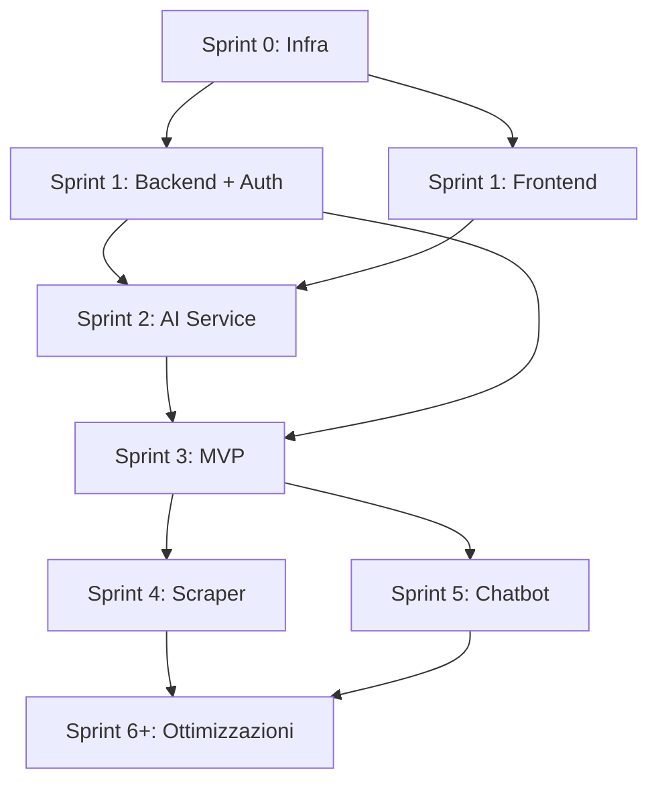

# VINTED OPTIMIZER — ROADMAP ENTERPRISE v2.0
> CovE Revised | Ottimizzata per sviluppo autonomo con GLM-4.7 Kilo Code
> Principio: **Ship fast, iterate** — MVP in 3 settimane

---

## 🎯 PRINCIPI ROADMAP (CovE Verified)

**Problemi roadmap originale:**
1. 11 fasi sequenziali → ritardo enorme prima di valore
2. Testing/Deploy in fase 9-10 → troppo tardi
3. Chatbot in fase 7 → priorità sbagliata
4. Nessun MVP incrementale

**Roadmap rivista:**
- MVP funzionante in **3 settimane** (fasi 1-3)
- CI/CD dal **giorno 1** (infrastruttura first)
- Feature rilasciate in **sprint settimanali**
- AI e Chatbot dopo il core

---

## 📅 SPRINT 0 (Giorno 1-2) — Infrastructure First

> **Goal**: Zero downtime da subito, mai. Setup infra prima del codice.

### Tasks

```
[ ] Account Fly.io + app create
[ ] Account Neon + database create + pgvector enable
[ ] Account Upstash + Redis database
[ ] Cloudflare tunnel su iMac
[ ] GitHub repo con branch strategy (main, develop, feature/*)
[ ] GitHub Actions CI/CD base (test + lint + deploy)
[ ] .mcp.json configurato per Kilo Code
[ ] CLAUDE.md in root progetto
[ ] Struttura monorepo (services/ + packages/)
[ ] Dockerfile per API (multi-stage)
[ ] fly.toml configurato
[ ] fly secrets set (tutte le env vars)
[ ] FIRST DEPLOY: app vuota che risponde /api/health → 200
[ ] Better Uptime monitor attivo
[ ] Sentry DSN configurato
```

### Deliverable Sprint 0
✅ Infrastruttura cloud funzionante  
✅ CI/CD che deploya ad ogni push su main  
✅ Monitoring attivo  
✅ iMac connesso al cloud via tunnel  

---

## 📅 SPRINT 1 (Settimana 1) — Core Backend + Auth

> **Goal**: API funzionante con autenticazione. Listing CRUD base.

### Backend Tasks

```
[ ] FastAPI project structure (services/api/)
[ ] Settings con Pydantic + env vars
[ ] SQLAlchemy async engine + Base model
[ ] Alembic setup + prima migrazione (users, listings, images)
[ ] User model + Supabase Auth integrazione (oppure JWT custom)
[ ] Auth endpoints: register, login, refresh, logout
[ ] Listing model + CRUD endpoints base
[ ] Image upload (Fly.io volumes o Cloudflare R2)
[ ] ARQ worker setup base
[ ] OpenTelemetry setup
[ ] Test: 70%+ coverage su services
[ ] Swagger docs accessibili in staging
```

### Frontend Tasks (parallelo)

```
[ ] Next.js 14 project setup con TypeScript strict
[ ] Tailwind + shadcn/ui setup
[ ] Layout base (sidebar + header + footer)
[ ] Auth pages (login, register) con NextAuth
[ ] Dashboard placeholder con skeleton loader
[ ] TanStack Query setup
[ ] Zustand store base
[ ] Deploy su Cloudflare Pages
```

### Deliverable Sprint 1
✅ Login/Register funzionante  
✅ CRUD Listings via API  
✅ Frontend con auth funzionante  
✅ Deploy automatico su ogni PR  

---

## 📅 SPRINT 2 (Settimana 2) — AI Service + Image Analysis

> **Goal**: Analisi immagini con Ollama locale funzionante end-to-end.

### AI Service Tasks

```
[ ] FastAPI AI service setup (services/ai-service/)
[ ] Ollama integration (moondream2 + phi3:mini)
[ ] /analyze endpoint: immagine → analisi prodotto JSON
[ ] /embed endpoint: testo → embedding nomic
[ ] /generate endpoint: descrizione listing da analisi
[ ] DuckDB cache locale (TTL 24h)
[ ] Semaphore per max 1 request concurrent
[ ] Fallback a Z.ai API se Ollama timeout
[ ] LaunchAgent per avvio automatico su iMac
[ ] Health check endpoint
[ ] Test con immagini Vinted reali
```

### Integrazione Backend → AI

```
[ ] Backend: proxy /api/v1/images/analyze → AI service
[ ] Backend: image processing pipeline (resize, optimize)
[ ] Backend: arricchimento automatico listing post-upload
[ ] Frontend: upload immagine + progress bar
[ ] Frontend: visualizzazione analisi AI
[ ] Frontend: form pre-compilato da AI (modificabile)
[ ] pgvector: store embedding per similarità prodotti
```

### Deliverable Sprint 2
✅ Upload immagine → analisi AI automatica  
✅ Listing pre-compilato da AI  
✅ Suggerimento prezzo da AI  
✅ AI service stabile su iMac  

---

## 📅 SPRINT 3 (Settimana 3) — MVP RELEASE

> **Goal**: MVP completo con vendite, spedizioni base, dashboard.

### Sales & Shipments

```
[ ] Sale model + CRUD endpoints
[ ] Shipment model + CRUD endpoints
[ ] Sendcloud integration: get_methods, create_parcel
[ ] 17track integration: tracking query
[ ] PDF etichetta spedizione
[ ] Frontend: pagina vendite
[ ] Frontend: pagina spedizioni con tracking
[ ] Frontend: genera etichetta button
```

### Dashboard Base

```
[ ] Dashboard overview endpoint (aggregati)
[ ] KPI cards: vendite, revenue, listing attivi, spedizioni
[ ] Grafico vendite mensili (Recharts)
[ ] Lista attività recente
[ ] Filtri per utente (multi-account)
```

### Multi-Account

```
[ ] Role system: admin, member
[ ] Familiare può essere aggiunto da admin
[ ] Dashboard aggregata vs per-utente
[ ] Permessi granulari
```

### Deliverable MVP
✅ Sistema completo funzionante  
✅ Upload → analisi AI → pubblica listing  
✅ Vendi → crea spedizione → stampa etichetta  
✅ Dashboard con KPI  
✅ Multi-utente funzionante  

---

## 📅 SPRINT 4 (Settimana 4-5) — Scraper + Trend

> **Goal**: Dati di mercato automatici per pricing intelligente.

### Scraper Tasks

```
[ ] Scraper service setup (services/scraper-service/)
[ ] curl-cffi async session con impersonation
[ ] Vinted catalog API scraper (dati pubblici)
[ ] Rate limiter (min 3s tra requests)
[ ] DuckDB storage locale trend data
[ ] Sync trend data → cloud via API
[ ] APScheduler: job quotidiano ore 3:00
[ ] LaunchAgent per avvio automatico
[ ] Dashboard: sezione Trend mercato
[ ] AI: usa trend per pricing suggerito più accurato
```

### Deliverable Sprint 4
✅ Trend automatici da Vinted  
✅ Pricing suggerito basato su mercato reale  
✅ Dashboard trend per categoria/brand  

---

## 📅 SPRINT 5 (Settimana 6-7) — Chatbot + Notifiche

> **Goal**: Assistente AI contestuale e notifiche real-time.

### Chatbot RAG

```
[ ] ChromaDB setup con FAQ knowledge base
[ ] Ollama phi3:mini per chatbot
[ ] Tool calling: query vendite, statistiche, listing
[ ] Streaming response via WebSocket
[ ] Chat widget nel frontend (shadcn/ui Drawer)
[ ] Storico conversazioni in DB
[ ] Context: dati utente corrente in system prompt
```

### Notifiche Real-Time

```
[ ] WebSocket server (FastAPI + socket.io)
[ ] Notifiche in-app: nuova vendita, spedizione consegnata
[ ] Frontend: notification bell + dropdown
[ ] ARQ task per check nuove vendite Vinted
[ ] Email opzionale (Resend API, free 3K/mese)
```

### Deliverable Sprint 5
✅ Chatbot funzionante con dati reali  
✅ Notifiche push real-time  

---

## 📅 SPRINT 6+ — Ottimizzazioni Continue

> Features post-MVP in ordine di priorità:

### Alta Priorità
```
[ ] Pubblicazione automatica su Vinted (Playwright)
[ ] Aggiornamento automatico prezzi
[ ] Export CSV/Excel vendite
[ ] Report PDF mensile
[ ] PWA support (offline mode)
```

### Media Priorità
```
[ ] A/B testing titoli listing
[ ] Analisi best-performing keywords
[ ] Integrazione corrieri diretti (post Sendcloud)
[ ] API pubblica per integrazioni esterne
```

### Bassa Priorità
```
[ ] Mobile app (React Native)
[ ] Integrazione altri marketplace (Subito.it, eBay)
[ ] AI pricing dinamico
```

---

## 🔄 DEPENDENCY MAP (Rivista)



---

## ⚡ KILO CODE WORKFLOW PER OGNI SPRINT

### Inizio Sprint
```bash
# 1. Pull latest
git checkout develop && git pull

# 2. Crea feature branch
git checkout -b feat/sprint-N-description

# 3. Apri Kilo Code in VS Code
code .

# 4. Prompt iniziale per Kilo Code:
"""
Inizia Sprint N: [titolo sprint]
Leggi CLAUDE.md e agent-framework.md
Implementa i task del sprint in ordine di priorità.
Usa Preserved Thinking per pianificare prima di codificare.
"""
```

### Fine Sprint
```bash
# 1. Run tests
uv run pytest --cov=src --cov-fail-under=70

# 2. Run linters
uv run ruff check . && uv run ruff format --check .
uv run mypy services/api/src/

# 3. PR su develop → staging deploy automatico
git push origin feat/sprint-N-description
gh pr create --base develop --title "feat: Sprint N"

# 4. Smoke test staging
curl https://vinted-optimizer-api.fly.dev/api/health

# 5. Merge → main → prod deploy
```

---

## 📊 KPI PROGETTO

| Metrica | Target MVP | Target 3 mesi |
|---------|-----------|---------------|
| Time to first deploy | Giorno 2 | ✅ |
| API response time p50 | <100ms | <50ms |
| API response time p95 | <500ms | <200ms |
| Test coverage | 60% | 80% |
| Uptime | 99% | 99.5% |
| AI analysis time | <5s | <3s |
| Scraper success rate | 85% | 95% |
| User satisfaction | N/A | >4/5 |
